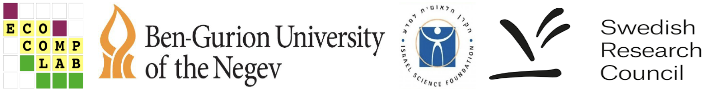

<br>
<br>

The package and this website were developed in the [Ecological Complexity Lab](http://www.bgu.ac.il/ecomplab), in Israel.

The R package code is available on GitGub here: [https://github.com/Ecological-Complexity-Lab/infomap_ecology_package](https://github.com/Ecological-Complexity-Lab/infomap_ecology_package)

<br>
<br>

# Grants

- Israel Science Foundation (grant number 1281/20): "Ecological multilayer networks: advancing theory and methodology for understanding the complexity of ecological systems", awarded to Dr. Shai Pilosof.
- Swedish Research Council (grant no. 2016-00796) , awarded to Martin Rosvall.
- Swedish Research Council (grant no. 2016-04919), awarded to Anna Eklöf.

<br>
<br>

# Feedback
We welcome any feedback on the paper and this website! The best way to provide feedback is to open an issue on the GitHub repository of the package: [https://github.com/Ecological-Complexity-Lab/infomap_ecology_package/issues](https://github.com/Ecological-Complexity-Lab/infomap_ecology_package/issues).

<br>

___

```{r out.height="80px", out.extra='style="float:left, padding:10px"', echo=FALSE}

```