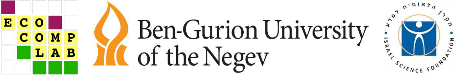

```{r klippy, echo=FALSE, include=TRUE}
# Use this to add a copy-code buttong
klippy::klippy(position = c('top', 'right'), color = 'darkred')
```

This site is an extension of the paper [Identifying flow modules in ecological networks using Infomap](https://onlinelibrary.wiley.com/doi/10.1111/2041-210X.13569) It contains installation instructions and very detailed Infomap commands and R code that we use in the examples that are presented in the paper. Infomap is a very rich implementation of the map equation, fully covered in [https://www.mapequation.org/](https://www.mapequation.org/). In this knowledge base we present what is most relevant for ecological network analysis and the R package `infomapecology`. The package is a convenient interface to use Infomap within R and to santdardize network data structures for a better workflow with other package such as igraph and bipartite. We will be updating this knowledge base with every improvement of `infomapecology`.___

```{r out.height="80px", out.extra='style="float:left, padding:10px"', echo=FALSE}

```


